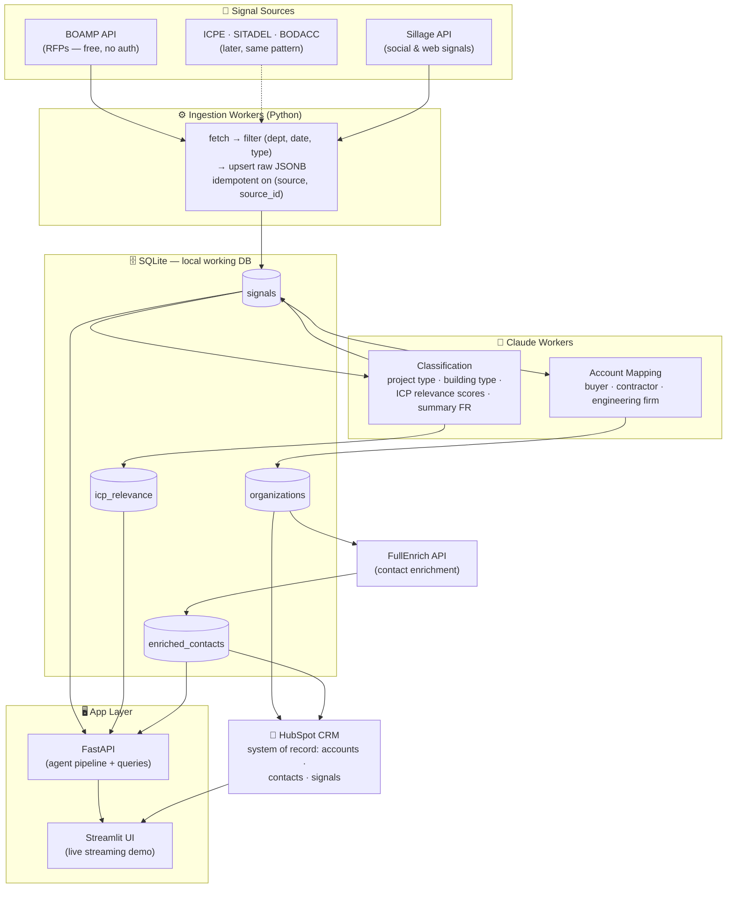

# Architecture — RFP Ingestion Database

Goal: get French public RFPs (BOAMP) into a queryable database that feeds the agent pipeline. Designed so RFP is just **signal type #1** — the same schema absorbs ICPE, SITADEL, BODACC, and Sillage signals later without a rework.

## Overview



**Storage decision (09/07):** no Supabase. SQLite (`data/gtm.db`) is the local working store for raw signals and the classification queue; **HubSpot is the system of record for GTM output** — mapped accounts, enriched contacts and surfaced signals land there as companies/contacts/notes with the `gtm_*` custom properties. Setup and API calls: [docs/hubspot.md](hubspot.md).

## Data model (ER)

```mermaid
erDiagram
    SIGNALS {
        bigserial id PK
        text type "rfp | icpe | permit | bodacc | sillage"
        text source "boamp | georisques | ..."
        text source_id UK "dedup key"
        date published_at
        date deadline_at "RFP response deadline"
        text departement
        jsonb raw "full source payload"
        text title
        text summary_fr "plain-French, reused in UI"
        text project_type "construction | extension | renovation"
        text building_type "warehouse | factory | logistics"
        text works "racking, flooring, electrical..."
        numeric est_value_eur
        timestamptz processed_at "NULL = awaiting classification"
    }

    ORGANIZATIONS {
        bigserial id PK
        text siren UK
        text name
        text kind "public_buyer | company | contractor | engineering"
        jsonb raw
    }

    SIGNAL_ORGANIZATIONS {
        bigint signal_id FK
        bigint org_id FK
        text role "buyer | winner | owner | contractor"
    }

    ICP_RELEVANCE {
        bigint signal_id FK
        text icp_category "equipment | envelope | installer | services | distributor"
        smallint score "0-100"
        text reasoning
    }

    ENRICHED_CONTACTS {
        bigserial id PK
        bigint org_id FK
        text full_name
        text job_title
        text email
        text phone
        text linkedin_url
        text source "fullenrich"
        jsonb raw
    }

        bigserial id PK
        bigint signal_id FK
        bigint contact_id FK
        text subject
        text body
    }

    SIGNALS ||--o{ SIGNAL_ORGANIZATIONS : "involves"
    ORGANIZATIONS ||--o{ SIGNAL_ORGANIZATIONS : "plays role in"
    SIGNALS ||--o{ ICP_RELEVANCE : "scored for"
    ORGANIZATIONS ||--o{ ENRICHED_CONTACTS : "has"
```

## Tech choices (hackathon-pragmatic)

| Component | Choice | Why |
|---|---|---|
| Working DB | **SQLite** (`data/gtm.db`) | Zero setup, each teammate runs locally; raw payloads + classification queue. `DATABASE_URL` env var overrides if ever needed. |
| System of record | **HubSpot CRM** (portal 148865690) | GTM output lives where a real sales team would work it: companies, contacts, notes + `gtm_*` custom properties. Free, shared, and a better demo story than a database. See [hubspot.md](hubspot.md). |
| Ingestion | Python scripts + `httpx` | One-shot backfill for the hackathon (last 90 days), no cron needed today |
| Classification | Claude (`claude-sonnet-4-6`), batched 10-20 announcements/call | Cheap, fast, structured output via tool use |
| API layer | FastAPI | Async, streams to the UI |
| UI | Streamlit | Fastest demo path |

## Schema

Schema SOT: `backend/db.py` (SQLite via SQLAlchemy; same tables work on Postgres if DATABASE_URL is set). Classification contract: `backend/workers/classify.py`. Do not duplicate DDL here.


## BOAMP ingestion details

**Endpoint:** `https://boamp-datadila.opendatasoft.com/api/explore/v2.1/catalog/datasets/boamp/records`
Free, no auth, JSON. Standard OpenDataSoft Explore API: `where=`, `order_by=`, `limit=`/`offset=` (max 100/page).

**Filter strategy for the backfill (last 90 days):**
- `nature`/type = works + supplies (marchés de travaux et fournitures)
- Departments: start with the demo persona's 2-3 target departments
- Keyword/descriptor filter for industrial relevance (entrepôt, bâtiment industriel, plateforme logistique, rayonnage...) — cast wide, let Claude's classification do the precise filtering
- Inspect exact field names in the [API console](https://boamp-datadila.opendatasoft.com/explore/dataset/boamp/api/) first — schema has fields like `idweb`, `objet`, `nomacheteur`, `code_departement`, `dateparution`, `datelimitereponse`, `descripteur_libelle`

**Classification prompt contract (per announcement):** input = objet + description + buyer + CPV/descriptors → output (tool use, forced JSON): `{project_type, building_type, works[], icp_categories: [{category, score, reasoning}], summary_fr, est_value_eur}`. Announcements scoring <30 on all categories are kept in DB but flagged irrelevant (never delete — re-scoring is cheap, re-ingesting is annoying).

## Build order (today)

1. ~~Supabase~~ SQLite schema via `python -m backend.db` (done)
2. `ingest/boamp.py` — backfill script, target departments, 90 days (1-2h)
3. `workers/classify.py` — Claude batch classification of unprocessed rows (1-2h)
4. Sanity-check queries: "top 10 RFPs for an equipment manufacturer in dept 69" (30 min)
5. Plug the agent pipeline (mapping → FullEnrich → surfacing) on top
6. `sync/hubspot.py` — upsert mapped accounts + contacts, write signals via `gtm_*` properties

## Later (post-RFP, same pattern)

- `ingest/icpe.py` (Géorisques), `ingest/sitadel.py` (dataset download), `ingest/bodacc.py` (ODS API too — same client code as BOAMP)
- `ingest/sillage.py` — push mapped orgs as targets, pull signals back as `type='sillage'` rows
