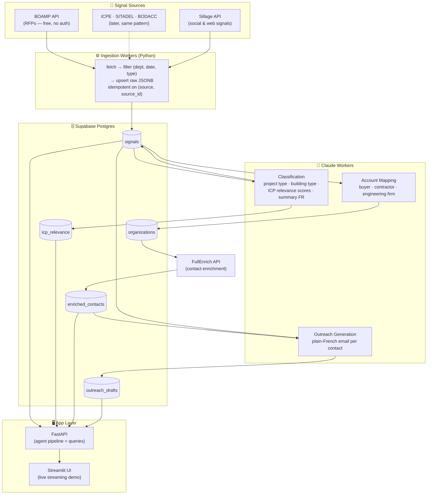
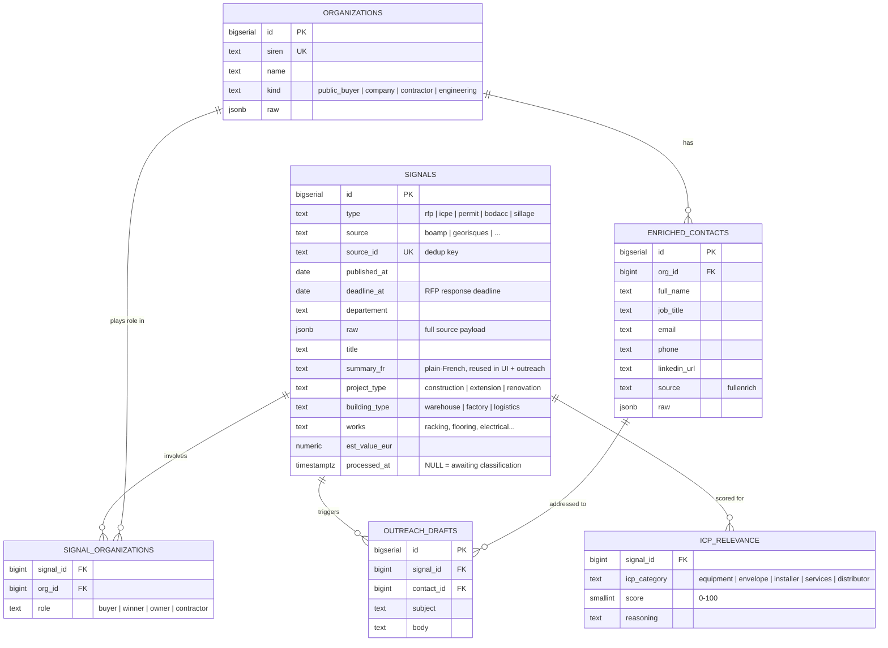

# Architecture — RFP Ingestion Database

Goal: get French public RFPs (BOAMP) into a queryable database that feeds the agent pipeline. Designed so RFP is just **signal type #1** — the same schema absorbs ICPE, SITADEL, BODACC, and Sillage signals later without a rework.

## Overview



## Data model (ER)



## Tech choices (hackathon-pragmatic)

| Component | Choice | Why |
|---|---|---|
| Database | **Supabase Postgres** (free tier) | Shared by 3-5 teammates instantly, JSONB for raw payloads, REST out of the box. Fallback: SQLite if network issues. |
| Ingestion | Python scripts + `httpx` | One-shot backfill for the hackathon (last 90 days), no cron needed today |
| Classification | Claude (`claude-sonnet-4-6`), batched 10-20 announcements/call | Cheap, fast, structured output via tool use |
| API layer | FastAPI | Async, streams to the UI |
| UI | Streamlit | Fastest demo path |

## Schema

```sql
-- Every buying signal, whatever the source. RFP first.
CREATE TABLE signals (
  id            BIGSERIAL PRIMARY KEY,
  type          TEXT NOT NULL,        -- 'rfp' | 'icpe' | 'permit' | 'bodacc' | 'sillage'
  source        TEXT NOT NULL,        -- 'boamp' | 'georisques' | ...
  source_id     TEXT NOT NULL,        -- BOAMP idweb — dedup key
  published_at  DATE,
  deadline_at   DATE,                 -- RFP response deadline (urgency!)
  departement   TEXT,
  region        TEXT,
  raw           JSONB NOT NULL,       -- full source payload, never lose data
  -- Claude-extracted fields:
  title         TEXT,
  summary_fr    TEXT,                 -- plain-French, reused in UI + outreach
  project_type  TEXT,                 -- 'construction' | 'extension' | 'renovation' | 'equipment'
  building_type TEXT,                 -- 'warehouse' | 'factory' | 'logistics' | 'public' | ...
  works         TEXT[],               -- ['racking','flooring','electrical',...]
  est_value_eur NUMERIC,
  processed_at  TIMESTAMPTZ,          -- NULL = awaiting classification
  UNIQUE (source, source_id)
);

-- Buyers, contractors, engineering firms
CREATE TABLE organizations (
  id      BIGSERIAL PRIMARY KEY,
  siren   TEXT UNIQUE,
  name    TEXT NOT NULL,
  kind    TEXT,                       -- 'public_buyer' | 'company' | 'contractor' | 'engineering'
  raw     JSONB
);

CREATE TABLE signal_organizations (
  signal_id BIGINT REFERENCES signals(id),
  org_id    BIGINT REFERENCES organizations(id),
  role      TEXT,                     -- 'buyer' | 'winner' | 'owner' | 'contractor'
  PRIMARY KEY (signal_id, org_id, role)
);

-- Which ICP categories each signal is relevant to (Claude classification)
CREATE TABLE icp_relevance (
  signal_id    BIGINT REFERENCES signals(id),
  icp_category TEXT,                  -- 'equipment' | 'envelope' | 'installer' | 'services' | 'distributor'
  score        SMALLINT,              -- 0-100
  reasoning    TEXT,
  PRIMARY KEY (signal_id, icp_category)
);

-- FullEnrich results
CREATE TABLE enriched_contacts (
  id         BIGSERIAL PRIMARY KEY,
  org_id     BIGINT REFERENCES organizations(id),
  full_name  TEXT, job_title TEXT, email TEXT, phone TEXT, linkedin_url TEXT,
  source     TEXT DEFAULT 'fullenrich',
  raw        JSONB,
  enriched_at TIMESTAMPTZ DEFAULT now()
);

-- Claude-generated outreach
CREATE TABLE outreach_drafts (
  id         BIGSERIAL PRIMARY KEY,
  signal_id  BIGINT REFERENCES signals(id),
  contact_id BIGINT REFERENCES enriched_contacts(id),
  subject    TEXT, body TEXT,
  created_at TIMESTAMPTZ DEFAULT now()
);
```

Why signal-centric: adding ICPE tomorrow = one new ingestion worker writing `type='icpe'` rows. Ranking, mapping, enrichment, outreach, and UI don't change.

## BOAMP ingestion details

**Endpoint:** `https://boamp-datadila.opendatasoft.com/api/explore/v2.1/catalog/datasets/boamp/records`
Free, no auth, JSON. Standard OpenDataSoft Explore API: `where=`, `order_by=`, `limit=`/`offset=` (max 100/page).

**Filter strategy for the backfill (last 90 days):**
- `nature`/type = works + supplies (marchés de travaux et fournitures)
- Departments: start with 2-3 target departments for the demo persona (69 Rhône + neighbors for Martine)
- Keyword/descriptor filter for industrial relevance (entrepôt, bâtiment industriel, plateforme logistique, rayonnage...) — cast wide, let Claude's classification do the precise filtering
- Inspect exact field names in the [API console](https://boamp-datadila.opendatasoft.com/explore/dataset/boamp/api/) first — schema has fields like `idweb`, `objet`, `nomacheteur`, `code_departement`, `dateparution`, `datelimitereponse`, `descripteur_libelle`

**Classification prompt contract (per announcement):** input = objet + description + buyer + CPV/descriptors → output (tool use, forced JSON): `{project_type, building_type, works[], icp_categories: [{category, score, reasoning}], summary_fr, est_value_eur}`. Announcements scoring <30 on all categories are kept in DB but flagged irrelevant (never delete — re-scoring is cheap, re-ingesting is annoying).

## Build order (today)

1. Supabase project + run schema (15 min)
2. `ingest/boamp.py` — backfill script, target departments, 90 days (1-2h)
3. `workers/classify.py` — Claude batch classification of unprocessed rows (1-2h)
4. Sanity-check queries: "top 10 RFPs for an equipment manufacturer in dept 69" (30 min)
5. Then plug the agent pipeline (mapping → FullEnrich → outreach) on top

## Later (post-RFP, same pattern)

- `ingest/icpe.py` (Géorisques), `ingest/sitadel.py` (dataset download), `ingest/bodacc.py` (ODS API too — same client code as BOAMP)
- `ingest/sillage.py` — push mapped orgs as targets, pull signals back as `type='sillage'` rows
